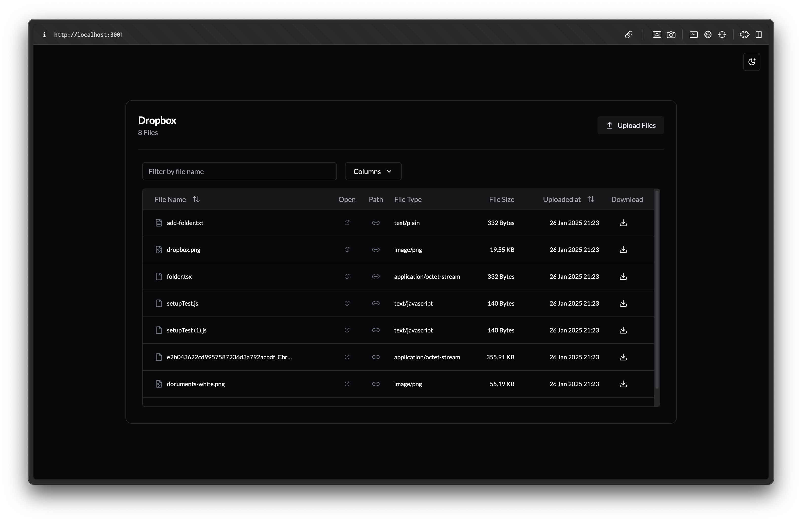
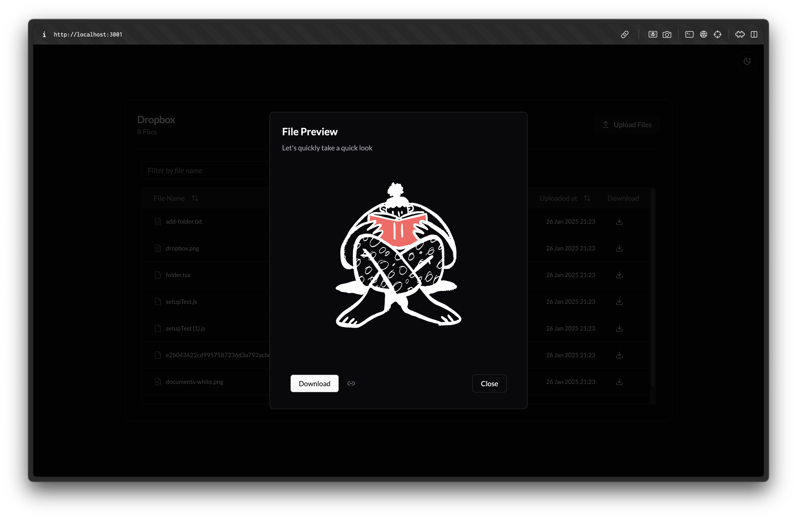
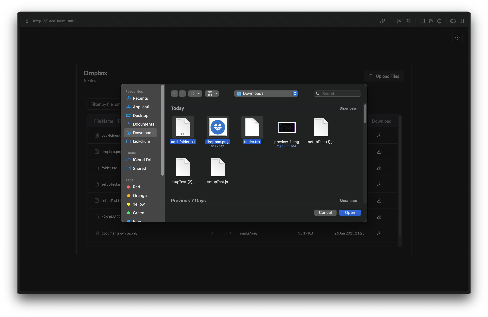
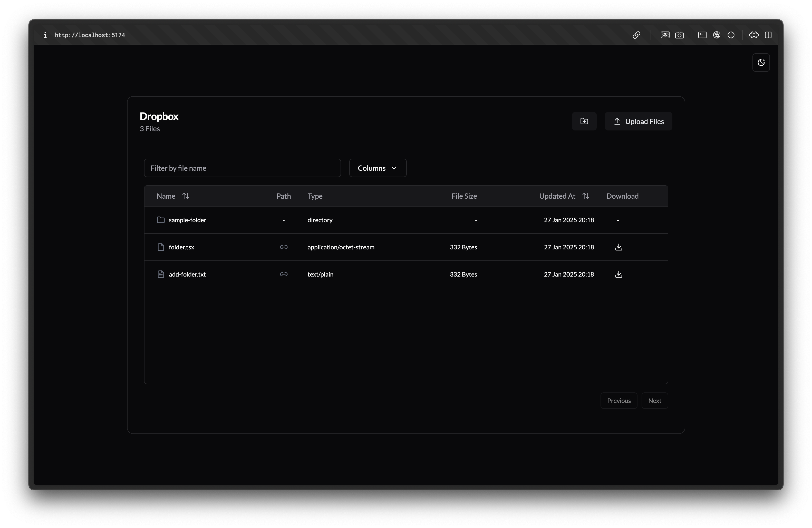

# Dropbox File Management Project
This is a simple file management project that handles file upload, preview, view and download. 
#### Home Page

#### Preview of the file uploaded

#### Multiple file upload

## Project Overview
[](https://skillicons.dev)

- **Monorepo**: Turbo
- **Frontend**: React + Vite
- **Backend**: Node.js/Express
- **Database**: PostgreSQL
- **Cloud Simulation**: LocalStack
- **Containerization**: Docker
- **Styling**: Tailwind CSS

## Prerequisites
* Docker
* Docker Compose
* Node.js (I am using v20.18.0)
* npm (I am using 11.0.0)

## Commands to Setup

### Install Dependencies
From the root directory run:
```bash
npm install
```

### Create Docker Network
```bash
docker network create dropbox_network
```

### Install AWS  CLI
Refer to [this](https://docs.aws.amazon.com/cli/latest/userguide/getting-started-install.html) for installation steps article based on your OS and configure AWS configure.

### Viewing App Locally
```bash
docker compose -f docker-compose.yml up -d --build
aws --endpoint-url=http://localhost:4566 s3 mb s3://dropbox-local-bucket
aws --endpoint-url=http://localhost:4566 s3api put-bucket-cors --bucket dropbox-local-bucket --cors-configuration file://cors.json
```
Open `http://localhost:3001/` to view the application

### Development Mode
```bash
docker compose -f docker-dev.yml up -d --build
aws --endpoint-url=http://localhost:4566 s3 mb s3://dropbox-local-bucket
aws --endpoint-url=http://localhost:4566 s3api put-bucket-cors --bucket dropbox-local-bucket --cors-configuration file://cors.json
npm run dev
```
Open `http://localhost:5173/` to view the frontend, backend runs at `http://localhost:3001/`
### Stop Containers
```bash
docker compose -f docker-dev.yml down -v
```

## Directory Structure
* `apps/api`: Backend that uses Node/Express 
* `apps/client`: Frontend in react+Vite
* `packages/logger`: Package for a common logger across the app
* `packages/ui/`: Package for all common UI components, mainly saves the shadcn components
* `packages/eslint-config/`:Collection of internal eslint configurations
* `packages/typescript-config/`: These are base shared `tsconfig.json`s from which all other `tsconfig.json`'s inherit from.


# Features Include
* Upload files ( any format ) - includes file replacement on change
* Preview file ( limited formats )
* Download file

# In other news
I was curious to see how a general file management system's UI(creating folders and files inside them) and backend would work and its routing, as I had not worked on it before. Its in a very early stage of implementation, and can be found in the branch called [`file-management`](https://github.com/mxthxngx/dropbox-file-management/tree/file-management). Please run the code in build mode not development mode.
You might want to clear out the volumes for the containers before running it. That can be done with the command:
```
 docker compose -f docker-compose.yml down -v
```
#### Sneak peak below: 

